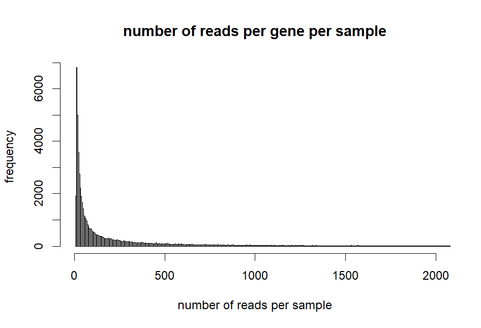
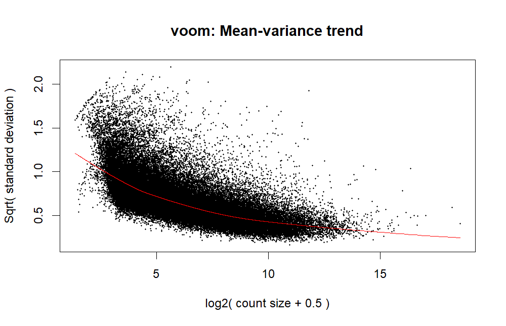
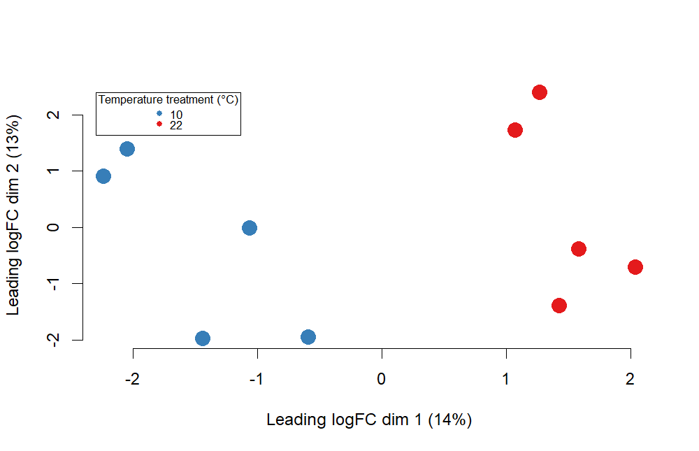

Once gene counts have been obtained and summarised within the RSEM_gene_counts file, differential expression analyses can be performed on the data. For this the R Studio software is utilised. **_Please note_**, this code is repeated for each individual tissue and species combination, used to compare expression between temperature treatments. **This example is for the brain tissue of the common triplefin**.

# Loading necessary libraries
``` r
library(tidyr)
library(DESeq2)
library(pheatmap)
library(stringr)
library(ggplot2)
library(dplyr)
library(matrixStats)
library(edgeR)
library(grid)
library("RColorBrewer")
library(ggrepel)
```
# Loading and subsetting the count data
The raw RSEM gene count data can be accessed here [RSEM_gene_counts.txt](https://github.com/breanariordan/triplefinRNA/blob/main/RSEM_gene_counts.txt)
``` r
# changing column names
original=read.csv("RSEM_gene_counts.txt", sep="", head=T)
head(original)
colnames(original) <- c ("10L1brain", "10L1heart", "10L2brain", "10L2heart", "10L3brain", "10L3heart", "10L4brain", "10L4heart", "10L5brain", "10L5heart", "10N1brain", "10N1heart", "10N2brain", "10N2heart", "10N3brain","10N3heart", "10N4brain", "10N4heart", "10N5brain", "10N5heart", "22L1brain", "22L1heart", "22L2brain", "22L2heart", "22L3brain", "22L3heart", "22L4brain", "22L4heart", "22L5brain", "22L5heart", "22N1brain", "22N1heart", "22N2brain", "22N2heart", "22N3brain", "22N3heart", "22N4brain", "22N4heart", "22N5brain", "22N5heart")

# subsetting data to target specific tissues and species, this will change depending on what you are looking at
subset_datalapillum <- original[, grepl("L", colnames(original))]
subset_datalapillumbrain <- subset_datalapillum[, grepl("brain", colnames(subset_datalapillumbrain))]

# creating temperature variable for comparison
sampleslapbrain <- cbind(colnames(subset_datalapillumbrain), rep(c("10", "22"), each = 5))
rownames(sampleslapbrain) <- sampleslapbrain[,1]
sampleslapbrain <- as.data.frame(sampleslapbrain[, -1])
colnames(sampleslapbrain) <- c("treatment")
sampleslapbrain$treatment <- factor(rep(c("10", "22"), each = 5))
```
# Basic filtering
``` r
des <- model.matrix(~sampleslapbrain$treatment)
dge <- DGEList(counts = subset_datalapillumbrain)
keep <- filterByExpr(subset_dataLapb, des)
dge <- dge[keep, keep.lib.sizes=TRUE]

dge <- calcNormFactors(dge)
dim(dge)
```
# Exploratory analyses and visualisation after filtering
``` r
# checking number of reads per gene
quantile(apply(dge$counts,1,sum)/10,seq(0,1,0.05)

hist(apply(dge$counts,1,sum)/10, xlim = c(0,2000), breaks = 100000, main = "number of reads per gene per sample", xlab = "number of reads per sample", ylab = "frequency")
```

``` r
# look at the most expressed genes
which(apply(dge$counts,1,sum)/10>1e5
```
# Performing the DE analysis
``` r
logCPM <- cpm(dge, log=TRUE)
design <- model.matrix(~sampleslapbrain$treatment)

v <- voom(dge, design, plot=TRUE, normalize="quantile")
```

``` r
# visualising clustering of samples
dev.off()
plotMDS(v, pch = 19, col = rep(c( "#377EB8","#E41A1C"), each = 5), cex = 2, frame = F, main = "", cex.axis = 1)
legend(x=-2.3, y=2.4, legend = c("10", "22"), col = c("#377EB8","#E41A1C"), pch = 19, cex = 0.7, title = "Temperature treatment (°C)")
```

``` r
# over/ underexpressed gene counts

fit <- lmFit(v, design)
fit <- eBayes(fit, trend=TRUE)
results <- topTable(fit, coef=ncol(design),n=Inf)

sum(results$adj.P.Val<0.05)

DE_results <- results[results$adj.P.Val<0.05,]
DE_counts<-dge[which(rownames(dge)%in%rownames(results)),]$counts

#Also take account logFC

DEdown<-DE_results[which(DE_results$logFC<(-1)),]
DEup<-DE_results[which(DE_results$logFC>(1)),]
DE_results<-rbind(DEdown,DEup)
```
# Creating the figures
``` r
# volcano plot

results <- results %>%  mutate(
  Expression = case_when(logFC >= 1 & adj.P.Val <= 0.05 ~ "Up-regulated",
  logFC <= -1 & adj.P.Val <= 0.05 ~ "Down-regulated",
  TRUE ~ "Unchanged"))

ggvolcano <- ggplot(results, aes(logFC,-log10(adj.P.Val))) +
  geom_point(aes(color = Expression), size = 3/5) +
  scale_color_manual(values = c(  "#E41A1C","gray50","#377EB8")) +
  theme_minimal() + theme(legend.text=element_text(size=6)) +
  xlab(expression("log"[2]*"FC")) + 
  ylim(0,6.5) +
  xlim(-8,8) +
  ylab(expression("-log"[10]*"FDR")) +
  guides(colour = guide_legend(override.aes = list(size=6),legend.key.size=6,title="")) 

ggvolcano
```
PICTURE
# Creating tables for Gene Ontology analyses

``` r
